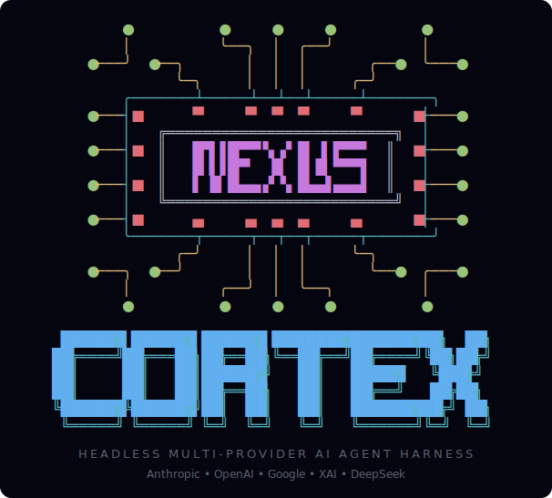

<p align="center">
  
</p>

# Nexus Cortex

> **A headless, multi-provider AI agent harness — embed it as a library, script it from the CLI, or run it as a stateful agent server.**

[](https://www.npmjs.com/package/@nexus-cortex/cli)
[](./LICENSE)
[](https://nodejs.org)

Nexus Cortex is the engine *underneath* the agent — not another interactive terminal app, but the harness you build on. One orchestrator drives many models across many providers through a pluggable adapter layer, with sub-agents, MCP, sandboxed artifacts, a permission engine, context management, and append-only session history built in.

Run it three ways: **as a library** (`import { CortexOrchestrator }`), **as a headless CLI** (`cortex "…"`), or **as a stateful HTTP agent server**.

> **Release 1 is the headless harness** — `core`, `executors`, `server`, `cli`. The interactive React/Ink terminal UIs (`@nexus-cortex/tui`) land in Release 2.

## Quick Start

```bash
npm install -g nexus-cortex
```

That's it — the `cortex` command is now on your PATH. Add at least one provider key: rename **`.env.example`** to **`.env`** and put a valid LLM key in it (e.g. `ANTHROPIC_API_KEY=…`).

Then just talk to it — **the server auto-starts on first use**, no separate step:

```bash
# Chat (multi-turn — the session persists across calls)
cortex "What is this project?"
cortex "Now summarize the largest file"

# One-shot autonomous agent in any directory (alias: `cortex run`)
cortex agent --cwd ./my-project "add a --version flag to the CLI and run the tests"
```

> Claude also works with a Claude.ai Pro/Max OAuth subscription instead of an API key — see [docs/authentication.md](docs/authentication.md). For advanced `.env` setup, see [docs/configuration.md](docs/configuration.md).

## Why Nexus Cortex

- **Every major provider, one harness.** The five major labs — **Anthropic, OpenAI, Google/Gemini, xAI, and DeepSeek** — are proven end-to-end. A dozen more (Cloudflare Workers AI, Zhipu/GLM, Qwen, Moonshot/Kimi, MiniMax, Mercury) are wired through the same adapter layer. <!--AUTO-COUNT:models-->84<!--/AUTO-COUNT--> models across <!--AUTO-COUNT:providers-->11<!--/AUTO-COUNT--> providers in all — switch mid-session, route from benchmark history, or mix providers across sub-agents. Run `cortex models list` for the live set.
- **Headless and scriptable by design.** No UI required. Pipe JSON, resume sessions by ID, and chain multi-turn agent workflows — the server is a *stateful agent*, not a stateless endpoint.
- **An embeddable engine, not a closed app.** The orchestrator, adapters, <!--AUTO-COUNT:tools-->45<!--/AUTO-COUNT--> built-in tools, and middleware are a clean TypeScript library you build on.
- **A real harness, batteries included.** Parallel sub-agents (`Task`) with per-agent permissions, MCP tool integration, a sandboxed-artifact toolset (run + inspect real web apps), git/PR tooling, a policy-based permission engine, token-budget + prompt-cache context management, and append-only JSONL sessions with file checkpoints.
- **A built-in improvement loop (opt-in).** Build a baseline and a candidate, benchmark both on a graded task set, and gate a keep/discard decision with real statistics — driving the harness's own self-improvement (inspired by [karpathy/autoresearch](https://github.com/karpathy/autoresearch)).

## Documentation

| Doc | What's in it |
|-----|--------------|
| **[User Guide](docs/user-guide.md)** | The `cortex` CLI in full, running the HTTP server, the REST API, sessions, PR review, production deployment, troubleshooting |
| **[Architecture](docs/architecture.md)** | Monorepo layout, the orchestrator, providers, tools, sub-agents, auto-research, and the other core systems |
| **[Authentication](docs/authentication.md)** | Provider API keys and Claude OAuth setup |
| **[Configuration](docs/configuration.md)** | Every environment variable, annotated |
| **[Embed the library](docs/user-guide.md#install)** | Use `@nexus-cortex/core` directly in your own code |
| **[Changelog](CHANGELOG.md)** | Release history |

## Contributing

Contributions welcome — see **[CONTRIBUTING.md](CONTRIBUTING.md)**.

## License

Apache-2.0 — see [LICENSE](LICENSE) and [NOTICE](NOTICE). Copyright 2026 Spitfire-Products.

Built clean-room as a multi-provider TypeScript agent harness.
